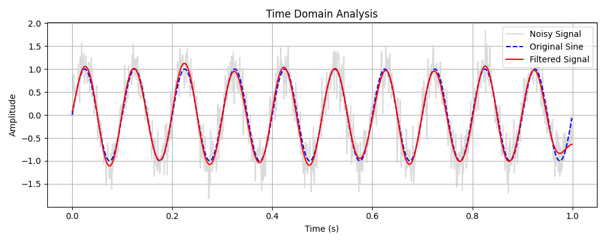
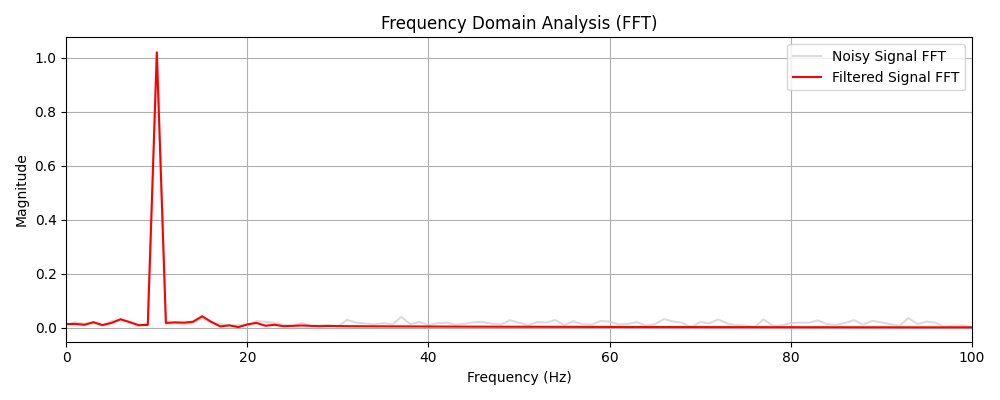

# Digital Signal Analyzer

A Python-based Digital Signal Processing (DSP) application with an interactive Tkinter GUI. This tool is designed to generate, process, and analyze digital signals in both the time and frequency domains. It serves as an excellent demonstration of core DSP concepts, making it ideal for educational purposes, interview preparations, or general signal analysis.vnfgjlfh,fasjfkdlsmcnkg

## Features

*   **Signal Generation**: Generate custom Sine waves, Square waves, and Random Noise. Control parameters such as Frequency, Amplitude, Phase, and Sample Rate.
*   **Real-world Data Support**: Load standard `.wav` audio files to analyze real-world signals.
*   **Signal Processing**: Apply transformations including:
    *   Adding Gaussian white noise.
    *   Smoothing using moving average filters.
    *   Applying Butterworth Low-pass and High-pass filters.
*   **Frequency Analysis**: Perform Fast Fourier Transform (FFT) to convert time-domain signals into the frequency domain.
*   **Interactive Visualizations**: Real-time visualization of signals (Original vs. Processed) and their Frequency Spectra using Matplotlib.

## DSP Concepts Explained (Interview Guide)

This project demonstrates several foundational concepts in Digital Signal Processing:

### 1. Signal Generation
Digital signals are represented as discrete values over time. In this tool, signals are generated by mapping mathematical functions (like $y(t) = A \cdot \sin(2\pi f t + \phi)$ for a sine wave) to a discrete time array $t$ created using a specific `sample_rate`. 
*   **Sampling Rate**: Determines how many samples are captured per second. According to the Nyquist theorem, to properly represent a frequency $f$, the sampling rate must be at least $2f$.

### 2. Filtering and Processing
Filtering modifies the frequency content of a signal.
*   **Smoothing (Moving Average)**: Acts as a basic low-pass filter by averaging adjacent points, which reduces rapid variations (high-frequency noise).
*   **Butterworth Filters**: Designed to have a flat frequency response in the passband. 
    *   *Low-pass filter*: Allows low frequencies to pass and attenuates frequencies higher than the cutoff. Useful for removing high-frequency noise.
    *   *High-pass filter*: Allows high frequencies to pass and blocks low frequencies. Useful for removing DC offset or low-frequency rumble.

### 3. Fast Fourier Transform (FFT)
The FFT is an efficient algorithm to compute the Discrete Fourier Transform (DFT). It converts a time-domain signal into its constituent frequency components (the frequency domain).
*   *Why use FFT?* It reveals which frequencies are present in a signal and at what magnitudes, which is often completely hidden in the time-domain representation. For instance, after applying a low-pass filter, the FFT clearly shows the attenuation of frequencies above the cutoff.

## Setup Instructions

1.  **Clone the Repository**
    ```bash
    git clone https://github.com/yourusername/digital-signal-analyzer.git
    cd digital-signal-analyzer
    ```

2.  **Install Dependencies**
    Ensure you have Python 3.8+ installed. Install the required libraries using `pip`:
    ```bash
    pip install numpy scipy matplotlib
    ```
    *Note: `tkinter` is included in the standard Python library on Windows and macOS. On Linux, you may need to install it via your package manager (e.g., `sudo apt-get install python3-tk`).*

3.  **Run the Application**
    ```bash
    python main.py
    ```

## Sample Outputs

### Time Domain Analysis
Shows the original signal, the signal with added noise, and the result after applying a low-pass filter.


### Frequency Domain Analysis (FFT)
Shows the frequency spectrum of the noisy signal and how the high-frequency noise components are attenuated after applying the low-pass filter.


## Code Structure

*   `main.py`: Entry point of the application.
*   `gui.py`: Contains the Tkinter user interface and Matplotlib integration.
*   `signal_generator.py`: Classes for generating synthetic signals (Sine, Square, Noise) and loading WAV files.
*   `signal_processor.py`: Implementation of filters and noise addition.
*   `fourier_transform.py`: FFT computation and frequency spectrum formatting.
*   `generate_screenshots.py`: Utility script to generate the sample output images.

## License

MIT License
